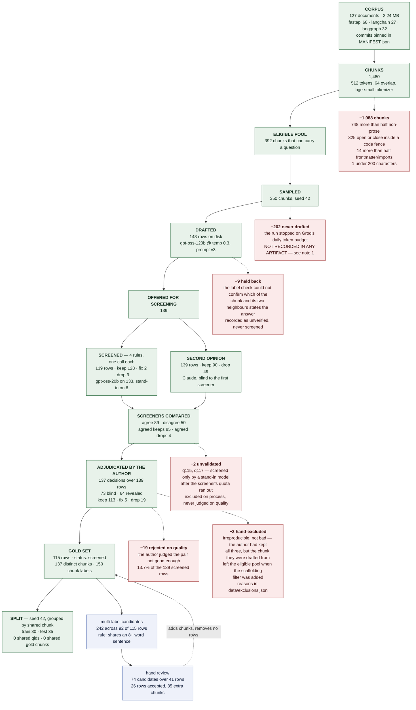

# Day 1 — the gold-set pipeline, with real counts

Every number below is counted from a committed artifact, not typed in. The
commands that reproduce each one are in the table at the bottom.

Read `docs/02_EVALUATION_SPEC.md` §1 for *why* the pipeline has these stages.
This file is only concerned with *how many rows survived each one, and why the
rest did not*.

---



---

## The arithmetic that has to close

```
139 screened
 − 19 rejected on quality        (author's verdict: drop)
 −  3 hand-excluded              (irreproducible, data/exclusions.json)
 −  2 unvalidated                (stand-in screener, q115 and q117)
= 115 gold rows                  (82.7% of screened)
```

Accepted rows are 110 `keep` + 5 `fix`. The 115 rows carry 150 chunk labels
across 137 distinct chunks, because 26 rows were multi-labelled. The split lands
at 80/35 — 69.6%, not exactly 70% — because whole groups of chunk-sharing rows
have to move to the same side together.

## Where the human sat in the loop

| pass | date | rows | mode | agreement with the screener |
|---|---|---|---|---|
| disputed + controls | 2026-08-16 | 62 | revealed after each keypress | 37/62 |
| full coverage of agreed keeps | 2026-08-17 | 73 | fully blind | 70/73 (96%) |
| rejection stratum (q017, q042) | 2026-08-19 | 2 | revealed | 0/2 |
| **all decisions** | | **137** | | **107/137 (78%)** |

The 62-row and 2-row passes are the 64 "revealed" rows; 37/64 = 58%. Do not
read 96% against 58% as an anchoring effect — see `DEFENCE.md` Q5.

## Three notes the diagram cannot carry

1. **The drafting shortfall is not in an artifact.** 350 chunks were sampled
   and 148 draft rows exist. The spec explains the mechanism (Groq's daily
   token budget, `02_EVALUATION_SPEC.md` §1 "Budget"), but no run log, error
   row, or counter in this repository records where the run stopped. The
   "−202" in the diagram is `350 − 148`, not a measured figure.
2. **The eligible pool moved after drafting.** The scaffolding filter was added
   mid-Day-1 in response to the first audit. Nine drafted rows came from chunks
   that the filter now rejects. Three were excluded by hand for exactly that
   reason; five never made the gold set anyway; **one, `q017`, is in the gold
   set** and meets the stated exclusion criterion. See `DEFENCE.md` Q8.
3. **`--n 350` cannot be re-run to the same sample.** The eligible pool was 405
   chunks when the drafting run sampled it and is 392 now, so
   `sample_chunks(eligible, 350, 42)` today draws a different 350. The gold set
   is reproducible from `goldset_screened.jsonl` forward; it is not reproducible
   from the corpus.

## Reproducing each number

| number | command |
|---|---|
| 127 documents, 1,480 chunks | `python -m backend.ingest --corpus data/demo_corpus --dry-run` |
| 392 eligible, and the four rejection counts | snippet below |
| 148 drafted, 139 offered | `wc -l data/goldset_draft.jsonl data/goldset_draft_supplement.jsonl`, then count `status` |
| 139 screened, keep/fix/drop 128/2/9 | count `screen_verdict` in `data/goldset_screened.jsonl` |
| second opinion 90/49, disputed 50 | join `data/claude_screen.jsonl` on qid |
| 137 decisions, 73 blind, 107 agreed | `data/audit_results.json`, written by `backend.goldset.audit` |
| 115 gold, 19 rejected, 82.7% accepted | `python -m backend.goldset.assemble` (prints the census) |
| 26 multi-labelled rows, 35 extra chunks | `data/multilabel.json` |
| train 80 / test 35, no leakage | `python -m backend.goldset.split` |

The eligible-pool counts come from `select_eligible`, which needs no database
and no API key:

```python
from pathlib import Path
from backend.ingest import build_chunks, get_tokenizer
from backend.goldset.generate import select_eligible

chunks = build_chunks(
    corpus_dir=Path("data/demo_corpus"), corpus_id="demo",
    tokenizer=get_tokenizer("BAAI/bge-small-en-v1.5"), size=512, overlap=64,
)
pool = select_eligible(chunks)
print(len(pool.eligible), pool.too_much_code, pool.code_edges,
      pool.scaffolding, pool.too_short)
# 392 748 325 14 1
```
